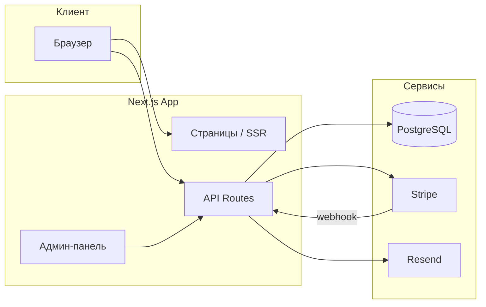

# Resale Shopping

**Полнофункциональный интернет-магазин премиального resale** — от каталога и корзины до оплаты, личного кабинета и админ-панели.

[](https://resale-shopping.ru)
[](https://nextjs.org)
[](https://www.typescriptlang.org)
[](https://www.prisma.io)
[](https://stripe.com)

> Продакшен-проект: [resale-shopping.ru](https://resale-shopping.ru) · репозиторий: [github.com/srgsprn/resale-shopping](https://github.com/srgsprn/resale-shopping)

---

## О проекте

**Resale Shopping** — e-commerce платформа для продажи брендовых вещей и аксессуаров в сегменте luxury resale. Проект разработан как полная миграция с WordPress/WooCommerce на современный full-stack стек с сохранением SEO, каталога и бизнес-процессов.

Автор: **Sergei Suprun**

| | |
|---|---|
| **Роль** | Full-stack разработка: архитектура, фронтенд, бэкенд, БД, деплой |
| **Статус** | Production, активная разработка |
| **Домен** | [resale-shopping.ru](https://resale-shopping.ru) |
| **Коммитов** | 140+ |

---

## Что реализовано

### Витрина и покупка

- Каталог с фильтрами (цена, бренд, пол, цвет, категория)
- Карточка товара с галереей, SEO-метаданными и статусами наличия
- Корзина (client-side) с live-бейджем в шапке
- Оформление заказа: форма клиента → создание заказа в БД → оплата Stripe
- Wishlist, подарочные карты, информационные страницы
- Адаптивный UI в премиальной эстетике (Tailwind CSS, Framer Motion)

### Пользователи и админка

- Регистрация и вход (NextAuth, OAuth Yandex)
- Личный кабинет: профиль, адрес, история заказов
- Админ-панель с ролевой моделью (`USER` → `ADMIN`)
- Управление товарами, брендами, категориями, заказами, SEO-страницами
- Загрузка изображений, CRUD через Server Actions

### Интеграции и инфраструктура

- **Stripe** — Checkout Session, webhook, статусы оплаты
- **Resend** — транзакционные письма после заказа
- **PostgreSQL + Prisma** — миграции, сиды, типобезопасные запросы
- **VPS** — Nginx, SSL (Certbot), PM2, автоматизированные deploy-скрипты
- Импорт и синхронизация каталога из legacy WordPress API

---

## Технологический стек

| Слой | Технологии |
|------|------------|
| **Frontend** | Next.js 16 (App Router), React 19, TypeScript, Tailwind CSS v4, Framer Motion |
| **Backend** | Next.js API Routes, Server Actions, Zod-валидация |
| **База данных** | PostgreSQL, Prisma ORM |
| **Auth** | NextAuth v5 (Credentials + Yandex OAuth) |
| **Платежи** | Stripe (Checkout + Webhooks) |
| **Email** | Resend / Nodemailer |
| **DevOps** | PM2, Nginx, Certbot, bash-скрипты деплоя |

---

## Архитектура



### Ключевой флоу оформления заказа

```
Корзина → Checkout (форма) → POST /api/checkout → Pending Order в БД
    → Stripe Checkout Session → Оплата → Webhook → Order PAID → Email клиенту
```

---

## Структура репозитория

```
resale-shopping/
├── app/                  # Страницы (App Router) и API routes
│   ├── catalog/          # Каталог с фильтрами
│   ├── product/[slug]/   # Карточка товара
│   ├── checkout/         # Оформление заказа
│   ├── account/          # Личный кабинет
│   ├── admin/            # Админ-панель
│   └── api/              # REST: checkout, stripe, auth, products
├── components/           # UI-компоненты (header, cart, filters, forms)
├── lib/                  # Бизнес-логика: orders, stripe, email, cart
├── prisma/               # Схема БД, миграции, seed
├── scripts/              # Деплой, импорт каталога, утилиты
└── public/               # Статика, изображения
```

Подробная техническая документация для разработчиков — в [`PROJECT OVERVIEW.md`](./PROJECT%20OVERVIEW.md).

---

## Быстрый старт (локально)

**Требования:** Node.js 20+, PostgreSQL

```bash
git clone https://github.com/srgsprn/resale-shopping.git
cd resale-shopping

cp .env.example .env
# Заполните DATABASE_URL, AUTH_SECRET, Stripe и др.

npm install
npm run db:generate
npm run db:migrate:dev
npm run db:seed
npm run dev
```

Приложение: [http://localhost:3000](http://localhost:3000)

### Основные команды

| Команда | Описание |
|---------|----------|
| `npm run dev` | Dev-сервер |
| `npm run build` | Production-сборка |
| `npm run catalog:sync` | Синхронизация каталога |
| `npm run deploy:vps:pull` | Pull + деплой на VPS |

---

## Деплой

Проект развёрнут на VPS (Ubuntu): **Nginx** → **PM2** → **Next.js** на порту 3001, SSL через Let's Encrypt.

```bash
# На сервере
bash scripts/vps-pull-and-deploy.sh
```

Скрипт выполняет `git pull`, `npm ci`, Prisma migrate, `next build` и `pm2 restart`.

---

## Переменные окружения

Минимальный набор для production:

```env
DATABASE_URL=postgresql://...
NEXT_PUBLIC_SITE_URL=https://resale-shopping.ru
AUTH_SECRET=...

STRIPE_SECRET_KEY=sk_...
NEXT_PUBLIC_STRIPE_PUBLISHABLE_KEY=pk_...
STRIPE_WEBHOOK_SECRET=whsec_...

RESEND_API_KEY=re_...
RESEND_FROM=Resale Shopping <orders@resale-shopping.ru>
```

Полный список — в [`.env.example`](./.env.example).

---

## Навыки, продемонстрированные в проекте

- Проектирование и разработка **full-stack e-commerce** с нуля до production
- **Next.js App Router**: SSR, API routes, middleware, Server Actions
- Работа с **реляционной БД**: проектирование схемы, миграции, оптимизация запросов
- Интеграция **платёжного провайдера** (Stripe) с webhook-обработкой
- **Аутентификация и авторизация** с ролевой моделью
- **DevOps**: деплой, SSL, process manager, bash-автоматизация
- Миграция legacy-системы (WordPress) без потери данных и SEO

---

## Контакты

**Sergei Suprun**

- GitHub: [@srgsprn](https://github.com/srgsprn)
- Email: [sergeysuprun@list.ru](mailto:sergeysuprun@list.ru)
- Сайт проекта: [resale-shopping.ru](https://resale-shopping.ru)

---

<sub>© Resale Shopping · MIT usage for portfolio review</sub>
